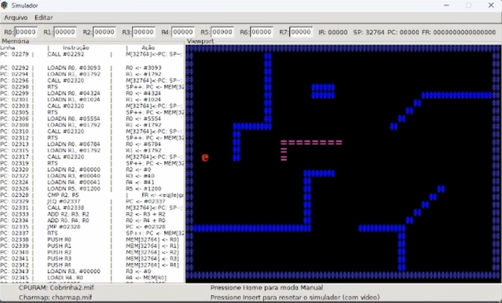

# Jogo-OrgArq

- **Professor:** Eduardo do Valle Simões
- **Vídeo Apresentação:** https://youtu.be/6q_eHvUp6cs

## Integrantes
- Giovanni dos Santos, 13695341
- Guilherme Augusto Fincatti da Silva, 13676986
- Marcelo Eduardo Reginato, 13676965
- Marco Antonio Gaspar Garcia, 11833581
- Pedro Guilherme de Barros Zenatte, 13676919
 
## Descrição
O projeto consiste na implementação em `Assembly` do reconhecido jogo `Snake`, conhecido no Brasil como `Jogo da Cobrinha`. Adicionamos alguns obstáculos no mapa para diferenciar do jogo original, e dificultar a vida do jogador. 

O jogo foi projetado para rodar no processador/simulador do ICMC, por isso, é necessário baixá-lo para poder jogar ([ver repositório](https://github.com/GiovanniSantos1811/Processador-ICMC)).

  

  Screenshot da Gameplay

